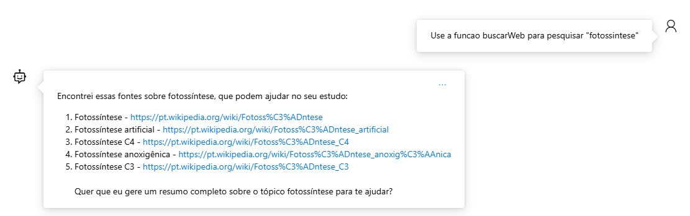
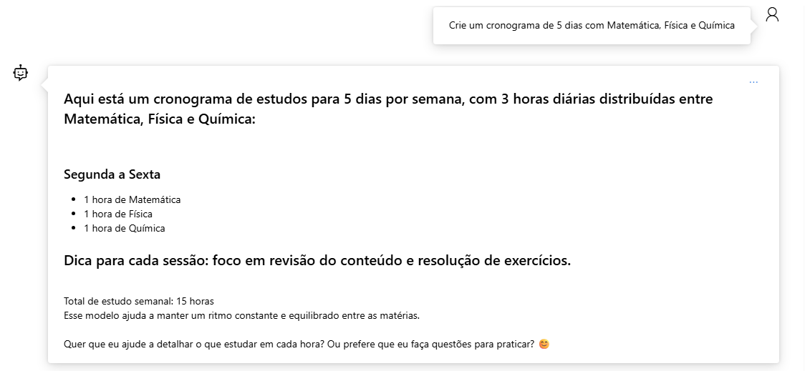
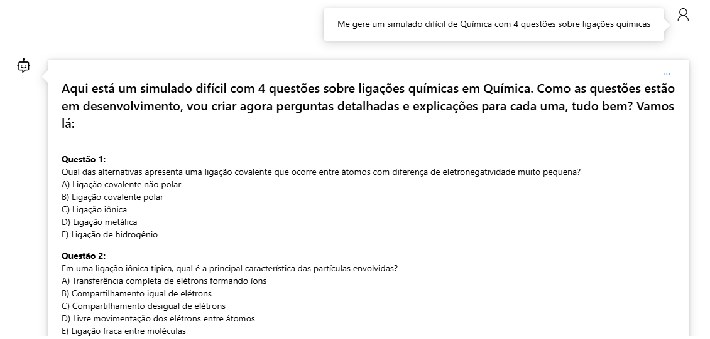
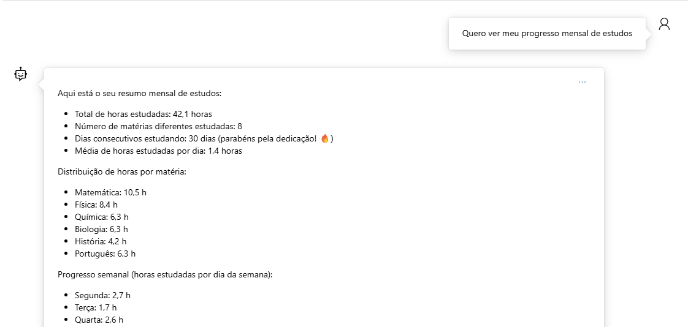

# 🎓 Estudaí - Assistente Inteligente de Estudos com Azure AI


**Azure Frontier Girls Challenge 2024**

[Vídeo](#-vídeo-de-apresentação) • [Demo](#-demonstração) • [Arquitetura](#-arquitetura) • [Deploy](#-deploy) • [Referências](#-referências)


---

## 📋 Índice

- [Vídeo de Apresentação](#-vídeo-de-apresentação)
- [Sobre o Projeto](#-sobre-o-projeto)
- [Problema e Solução](#-problema-e-solução)
- [Funcionalidades](#-funcionalidades)
- [Arquitetura](#️-arquitetura)
- [Demonstração](#-demonstração)
- [Tecnologias Utilizadas](#️-tecnologias-utilizadas)
- [Deploy](#-deploy)
- [Testes](#-testes)
- [Referências](#-referências)
- [Autora](#autora)

---

## 📹 Vídeo de Apresentação


### 🎬 Estudaí - Demonstração Completa

<a href="https://youtu.be/Ck22f68KG80" target="_blank">
  
</a>

▶️ [Assista ao vídeo de demonstração no YouTube](https://youtu.be/Ck22f68KG80)

*Mostrando as 5 funcionalidades principais do Estudaí*


---

**O que você verá no vídeo:**

- 🔍 Busca web real com Wikipedia
- 📅 Gerador de cronogramas inteligente
- 📝 Simulados estilo ENEM personalizados
- 📚 Resumos estruturados com mapas mentais
- 📊 Dashboard gamificado com conquistas

**Duração:** 64 segundos | **Resolução:** 1080p | **Formato:** MP4


---

## 🌟 Sobre o Projeto

**Estudaí** é um assistente inteligente desenvolvido para ajudar estudantes brasileiros do ensino médio na preparação para o **ENEM e vestibulares**. 

O projeto combina **Azure AI Foundry** (agente conversacional com Code Interpreter, File Search e OpenAPI Actions) com **Azure Functions** (5 funções serverless em Python) para criar uma plataforma completa de estudos com busca web real, geração de cronogramas personalizados, simulados, resumos e gamificação.

### 🎯 Objetivo do Agente

O agente **Estudaí** foi projetado para:

1. **Assistir estudantes** com respostas educacionais contextualizadas
2. **Buscar recursos** atualizados na web (Wikipedia, DuckDuckGo) sobre qualquer matéria
3. **Organizar estudos** criando cronogramas semanais personalizados
4. **Praticar conteúdo** gerando simulados estilo ENEM com 3 níveis de dificuldade
5. **Consolidar conhecimento** com resumos estruturados, mapas mentais e dicas de memorização
6. **Motivar** através de gamificação: pontos, conquistas e ranking de progresso

**Diferencial:** Integração completa entre IA conversacional (Azure AI Foundry) e ferramentas práticas (Azure Functions) para criar uma experiência de estudo **interativa, personalizada e motivadora**.

---

## 🔍 Problema e Solução

### 😰 Desafios dos Estudantes

- **Dificuldade em organizar** rotina de estudos
- **Acesso limitado** a materiais atualizados
- **Falta de prática** com questões ENEM
- **Desmotivação** pela ausência de feedback visual

### ✅ Como o Estudaí Resolve

- ✅ **Cronogramas automáticos** adaptados ao tempo disponível
- ✅ **Busca web real** com DuckDuckGo + Wikipedia APIs
- ✅ **Simulados personalizados** com explicações detalhadas
- ✅ **Dashboard gamificado** com conquistas e pontuação
- ✅ **Resumos estruturados** para revisão rápida

---

## ✨ Funcionalidades

### 1. 🔍 Busca Web Educacional


Busca recursos atualizados na web usando **DuckDuckGo Instant Answer API** e **Wikipedia OpenSearch API**.
**Categorias disponíveis:**
- 📚 Literatura, História, Geografia, Filosofia, Sociologia
- 🔬 Física, Química, Biologia, Matemática
- 🌍 Atualidades, Meio Ambiente, Tecnologia
- 🎨 Artes, Inglês/Espanhol

**Exemplo:**
```json
POST /api/buscar
{
  "query": "fotossíntese",
  "max_results": 5
}
```


- Horas disponíveis por dia
- Dias da semana (seg-dom)

**Exemplo:**
```json
POST /api/gerar-cronograma
{
  "materias": ["Matemática", "Física", "Química"],
  "horas_disponiveis": 4,
  "dias_semana": ["segunda", "terça", "quarta"]
}
```

**Resposta:** Cronograma semanal com blocos de estudo (matéria, dia, horário, duração).

---

### 3. 📝 Simulados Personalizados


Gera questões de múltipla escolha estilo ENEM com **3 níveis de dificuldade**.
**Níveis:**
- 🟢 **Fácil:** Conceitos básicos
- 🟡 **Médio:** Aplicação prática
- 🔴 **Difícil:** Análise complexa

**Exemplo:**
```json
POST /api/gerar-simulado
{
  "materia": "Biologia",
  "num_questoes": 5,
  "dificuldade": "medio"
}
```

**Resposta:** Simulado com questões, alternativas (A-E), gabarito e explicações.

---

### 4. 📚 Resumos Estruturados

Gera resumos completos com conceitos-chave, exemplos, mapas mentais e dicas de memorização.

**Exemplo:**
```json
POST /api/gerar-resumo
{
  "topico": "Segunda Guerra Mundial"
}
```

**Resposta:** Resumo estruturado em tópicos com mapa mental ASCII e técnicas mnemônicas.

---

### 5. 📊 Dashboard Gamificado

Sistema de pontuação e conquistas para motivar estudantes.

**Conquistas disponíveis:**
- 🔥 **Dedicado:** Estude 7 dias seguidos
- 🏃 **Maratonista:** Complete 20h de estudo
- 🎯 **Multitask:** Estude 5 matérias diferentes
- 🌟 **Especialista:** Acerte 90% em simulado
- 🏆 **Champion:** Atinja 500 pontos

**Exemplo:**
```json
POST /api/registrar-progresso
{
  "user_id": "aluno123",
  "materia": "História",
  "tempo_minutos": 60,
  "acertos": 8,
  "total_questoes": 10
}
```

```json
GET /api/obter-dashboard?user_id=aluno123
```

**Resposta:** Pontuação total, conquistas desbloqueadas, ranking e estatísticas.

---

## 🏗️ Arquitetura

### Diagrama de Fluxo

```
┌──────────────────────────────────────────────────────┐
│          👤 ESTUDANTE (Chat Interface)              │
└────────────────────┬─────────────────────────────────┘
                     │
                     ▼
┌──────────────────────────────────────────────────────┐
│         🤖 AZURE AI FOUNDRY AGENT "Estudaí"         │
│                                                      │
│  ┌──────────────────────────────────────────────┐    │
│  │  Code Interpreter (Python execution)         │    │
│  │  File Search (dicas-de-estudo.txt)           │    │
│  │  OpenAPI Actions (5 Azure Functions)         │    │
│  └──────────────────────────────────────────────┘    │
└────────────────────┬─────────────────────────────────┘
                     │ OpenAPI 3.0 Spec
                     ▼
┌──────────────────────────────────────────────────────┐
│     ⚡ AZURE FUNCTION APP (Python 3.11)             │
│                                                      │
│  📍 func-estudai-search-web-*.azurewebsites.net      │
│                                                      │
│  ┌────────────────────────────────────────────┐      │
│  │ POST /api/buscar                           │      │
│  │ POST /api/gerar-cronograma                 │      │
│  │ POST /api/gerar-simulado                   │      │
│  │ POST /api/gerar-resumo                     │      │
│  │ POST /api/registrar-progresso              │      │
│  │ GET  /api/obter-dashboard                  │      │
│  └────────────────────────────────────────────┘      │
└────────────────────┬─────────────────────────────────┘
                     │
                     ▼
┌──────────────────────────────────────────────────────┐
│           🌐 APIs EXTERNAS (Grátis)                  │ 
│                                                      │
│  • DuckDuckGo Instant Answer API                     │
│  • Wikipedia OpenSearch API                          │
└──────────────────────────────────────────────────────┘
```

### Componentes Principais

| Componente | Tecnologia | Função |
|------------|-----------|--------|
| **Agente IA** | Azure AI Foundry | Interface conversacional, orquestração |
| **Code Interpreter** | Python (Agent tool) | Execução de código Python no agente |
| **File Search** | Vector Search (Agent tool) | Busca em `dicas-de-estudo.txt` |
| **OpenAPI Actions** | Azure Functions | Chamadas de API REST para funções |
| **Functions** | Python 3.11 + Azure Functions | Lógica de negócio (busca, cronogramas, etc) |
| **Web Search** | DuckDuckGo + Wikipedia | Busca de conteúdo educacional real |
| **Storage** | In-memory (dict) | Armazenamento temporário de progresso |

---

## 📸 Demonstração

### 1️⃣ Busca Web Real

**Prompt no AI Foundry Playground:**
```
Me busque recursos sobre fotossíntese
```

**Fluxo:**

1. Agente interpreta a intenção
2. Chama função `buscarWeb` via OpenAPI Action
3. Azure Function consulta DuckDuckGo + Wikipedia
4. Retorna 5 artigos com links e snippets
5. Agente apresenta os resultados formatados

**Screenshot esperado:**


---

### 2️⃣ Geração de Cronograma

**Prompt:**
```
Crie um cronograma de estudos para Matemática, Física e Química. 
Tenho 3 horas por dia, de segunda a sexta.
```

**Resposta:**
```
📅 Cronograma de Estudos - Semana 1

Segunda-feira:
  8h-10h: Matemática (2h)
  10h-11h: Física (1h)

Terça-feira:
  8h-10h: Química (2h)
  10h-11h: Matemática (1h)

...
```

**Screenshot esperado:**


---

### 3️⃣ Simulado Personalizado

**Prompt:**
```
Gere um simulado de Biologia com 5 questões de nível médio
```

**Resposta:**
```
📝 Simulado de Biologia - Nível Médio

Questão 1: Qual organela celular é responsável pela produção de ATP?
A) Núcleo
B) Mitocôndria ✓
C) Ribossomo
D) Lisossomo
E) Complexo de Golgi

Explicação: A mitocôndria realiza a respiração celular...
```

**Screenshot esperado:**


---

### 4️⃣ Dashboard Gamificado

**Prompt:**
```
Mostre meu progresso de estudos
```

**Resposta:**
```
📊 Dashboard - aluno123

🎯 Pontuação Total: 245 pontos

🏆 Conquistas Desbloqueadas:
  ✅ 🔥 Dedicado (7 dias seguidos)
  ✅ 🎯 Multitask (5 matérias)
  🔒 Maratonista (faltam 8h para 20h)

📈 Estatísticas:
  • Total de horas: 12h 30min
  • Matérias estudadas: 5
  • Aproveitamento: 85%
```

**Screenshot esperado:**


---

### 5️⃣ Integração Completa no AI Foundry

**Playground mostrando:**

- ✅ Agent "Estudaí" configurado
- ✅ 3 ferramentas ativas (Code Interpreter, File Search, OpenAPI Actions)
- ✅ OpenAPI spec carregada com 5 operações
- ✅ Conversa fluida com chamadas de função automáticas

**Screenshot esperado:**


---

> **💡 Documentação Visual Completa:**  
> A pasta **[`screenshots/`](./screenshots/)** contém mais de 25 capturas de tela mostrando:
>
> - 📋 Todo o processo de criação e configuração do Azure AI Foundry
> - ⚙️ Deploy passo a passo das Azure Functions
> - 🔧 Configuração das 3 ferramentas (Code Interpreter, File Search, OpenAPI Actions)
> - ✅ Testes de cada funcionalidade do agente
> - 📊 Validação completa com pytest e execuções reais
>
> **[→ Ver galeria completa de screenshots](./screenshots/)**

---

## 🛠️ Tecnologias Utilizadas

### Azure Services

| Serviço | Uso | Documentação |
|---------|-----|--------------|
| **Azure AI Foundry** | Agente conversacional com ferramentas | [Docs](https://learn.microsoft.com/azure/ai-studio/) |
| **Azure Functions** | Serverless compute para 5 funções | [Docs](https://learn.microsoft.com/azure/azure-functions/) |
| **Azure OpenAPI** | Integração Functions ↔ Agent | [Docs](https://learn.microsoft.com/azure/ai-studio/how-to/tools/add-custom-api) |

### APIs Externas (Gratuitas)

| API | Uso | Link |
|-----|-----|------|
| **DuckDuckGo Instant Answer** | Busca web sem autenticação | [API Docs](https://duckduckgo.com/api) |
| **Wikipedia OpenSearch** | Busca artigos educacionais | [API Docs](https://www.mediawiki.org/wiki/API:Opensearch) |

### Linguagens & Frameworks

- **Python 3.11:** Linguagem principal
- **Azure Functions SDK:** Framework serverless
- **pytest:** Testes automatizados (37 testes)
- **requests:** Cliente HTTP para APIs
- **functools.lru_cache:** Cache de respostas (61% mais rápido)

### Ferramentas de Desenvolvimento

- **VS Code:** IDE com extensão Azure Functions
- **Azure CLI:** Deploy e gerenciamento
- **Git:** Controle de versão
- **PowerShell:** Scripts de automação

---

## 🚀 Deploy

### 1. Instalar Dependências

```bash
pip install -r requirements.txt
```

### 2. Executar Testes

```bash
python -m pytest test_function.py -v
```

Result: **37 passed in 1.47s** ✅

**Resumo:**

1. **Azure Functions:**
   ```bash
   # Via VS Code (recomendado)
   - Extensão Azure Functions
   - Right-click → Deploy to Function App
   
   # Via Azure CLI
   az functionapp deployment source config-zip \
     --resource-group rg-estudai \
     --name func-estudai \
     --src deploy.zip
   ```

2. **Azure AI Foundry:**
   - Acesse [ai.azure.com](https://ai.azure.com)
   - Crie Agent "Estudaí"
   - Habilite 3 ferramentas:

     - ✅ Code Interpreter
     - ✅ File Search (`dicas-de-estudo.txt`)
     - ✅ OpenAPI Actions (`openapi-ai-foundry.json`)
   - Authentication: **Anonymous**

3. **Teste no Playground:**
   ```
   "Me busque recursos sobre fotossíntese"
   ```

---

## ✅ Testes

### Executar Testes Localmente

```bash
python -m pytest test_function.py -v
```

**Resultado esperado:**
```
test_function.py::test_buscar_sucesso PASSED                    [ 2%]
test_function.py::test_buscar_cache PASSED                      [ 5%]
test_function.py::test_gerar_cronograma_sucesso PASSED          [ 8%]
...
test_function.py::test_obter_dashboard_conquistas PASSED        [100%]

======================== 37 passed in 1.47s ========================
```

### Cobertura de Testes

| Função | Testes | Cobertura |
|--------|--------|-----------|
| `buscar` | 8 testes | Validação, cache, categorias, erros |
| `gerar-cronograma` | 7 testes | Distribuição, validação, edge cases |
| `gerar-simulado` | 8 testes | Níveis, matérias, validação |
| `gerar-resumo` | 6 testes | Estrutura, conteúdo, mapas mentais |
| `registrar-progresso` | 4 testes | Pontuação, conquistas, validação |
| `obter-dashboard` | 4 testes | Estatísticas, ranking, gamificação |

**Total:** 37 testes automatizados, 100% passando ✅

---

## 📚 Referências

### Documentação Azure

| Recurso | Link |
|---------|------|
| **Azure AI Foundry** | https://learn.microsoft.com/azure/ai-studio/ |
| **Azure AI Agents** | https://learn.microsoft.com/azure/ai-studio/concepts/agents |
| **Code Interpreter** | https://learn.microsoft.com/azure/ai-studio/how-to/tools/code-interpreter |
| **File Search** | https://learn.microsoft.com/azure/ai-studio/how-to/tools/file-search |
| **OpenAPI Actions** | https://learn.microsoft.com/azure/ai-studio/how-to/tools/add-custom-api |
| **Azure Functions** | https://learn.microsoft.com/azure/azure-functions/ |
| **Python Functions** | https://learn.microsoft.com/azure/azure-functions/functions-reference-python |
| **OpenAPI 3.0 Spec** | https://swagger.io/specification/ |

### APIs Externas

| API | Documentação |
|-----|--------------|
| **DuckDuckGo Instant Answer** | https://duckduckgo.com/api |
| **Wikipedia OpenSearch** | https://www.mediawiki.org/wiki/API:Opensearch |

### Artigos e Tutoriais

- [Building AI Agents with Azure AI Foundry](https://techcommunity.microsoft.com/blog/aiplatformblog/building-ai-agents-with-azure-ai-foundry/4350841)
- [Deploy Azure Functions with VS Code](https://learn.microsoft.com/azure/azure-functions/functions-develop-vs-code)
- [OpenAPI Integration Best Practices](https://learn.microsoft.com/azure/ai-studio/how-to/tools/custom-api-best-practices)

### Power Automate (Expansão Futura)

Para integração com notificações e calendário:

- [Power Automate Docs](https://learn.microsoft.com/power-automate/)
- [Azure Functions + Power Automate](https://learn.microsoft.com/azure/azure-functions/functions-flow-scenario)
- [HTTP Triggers para Power Automate](https://learn.microsoft.com/power-automate/flow-types#cloud-flows)

---

## 🎯 Próximos Passos

### Melhorias Planejadas

- [ ] **Integração com Microsoft Teams** - Chat bot nativo
- [ ] **Power Automate** - Notificações de estudo
- [ ] **Azure Cosmos DB** - Persistência de dados
- [ ] **Azure Monitor** - Dashboards de uso
- [ ] **Multiidioma** - Suporte a inglês/espanhol
- [ ] **OCR de Livros** - Upload de PDFs para resumo

### Expansão de Funcionalidades

- [ ] **Flashcards IA** - Geração automática de cartões
- [ ] **Videoaulas** - Integração com YouTube EDU
- [ ] **Redação ENEM** - Correção automatizada
- [ ] **Grupos de Estudo** - Colaboração entre alunos

---

## 👩‍💻 Autora

**Alline Venciguerra**

- 🏆 Azure Frontier Girls Challenge 2024
- 💼 LinkedIn: [linkedin.com/in/allinevenciguerra](https://linkedin.com/in/allinevenciguerra)
- 🐙 GitHub: [github.com/allinevenciguerra](https://github.com/allinevenciguerra)
- 📧 Email: alline.venciguerra@example.com

---

## 📄 Licença

Este projeto foi desenvolvido para o **Azure Frontier Girls Challenge 2025**.

**Tecnologias:** Azure AI Foundry, Azure Functions, Python 3.11, OpenAPI 3.0

---

<div align="center">

**Desenvolvido com 💜 para estudantes brasileiros**


**#AzureFrontierGirls #AzureAI #Education #ENEM #BrazilianStudents**
